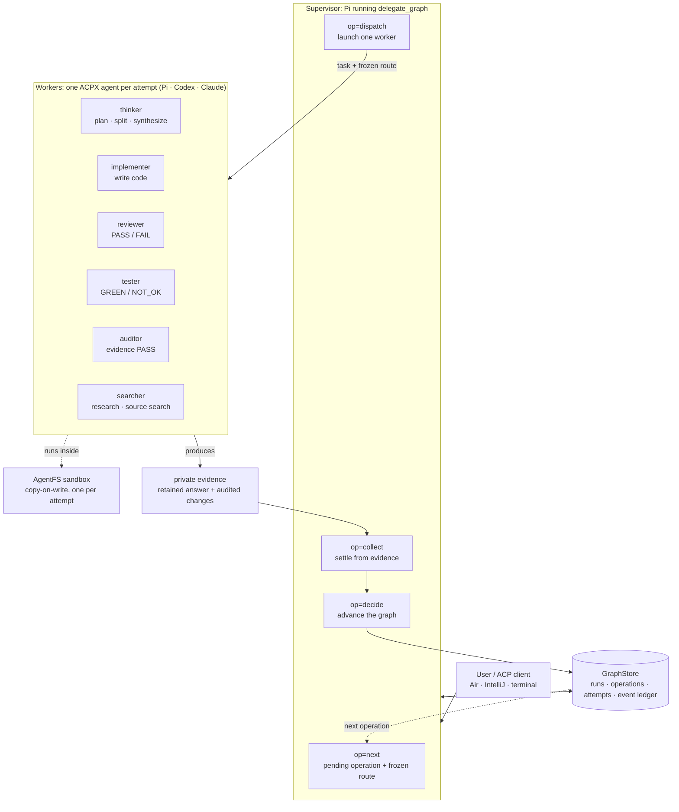

# pi-agent-wave

pi-agent-wave turns Pi into a supervisor for ordered, evidence-gated multi-agent work. It runs Pi, Codex, and Claude workers through ACPX, gives each attempt its own AgentFS copy-on-write sandbox, and records every run in a durable graph that JetBrains Air or a terminal can drive and inspect. Herdr is an optional presentation layer, never a requirement.

## Why use it?

- **Control Pi from Air.** Air owns the `pi-acp` session. pi-agent-wave reports structured progress, status, questions, cancellation, and results back through Pi's tool channel, so an ACP client can run a whole delegation without a terminal.
- **Keep complex work ordered.** A graph fixes the sequence of planning, implementation, review, testing, and audit. Nothing starts before its dependencies settle, and fan-outs join before the next node begins.
- **Isolate every attempt.** One ACPX session and one AgentFS sandbox per attempt. Writable roles stage only audited owned paths, placed into your workspace through a journal you can roll back; read-only roles stage nothing.
- **Require proof.** A run retains the worker's answer and audited changes as immutable facts before anything is closed or cleaned up, and advances only on an explicit, reasoned decision.
- **Keep presentation optional.** Headless mode needs no Herdr process or workspace. Inside a Herdr workspace the same runs gain visible worker tabs, a rendered view of each worker's stream, and a numbered agent list that opens by itself when a worker starts and shows each worker's details inside the terminal.

The package provides `/delegate`, `/graph`, `/failover`, the `delegate_graph` and `questionnaire` tools, cmux session metadata hooks, native model failover, and the integrated `claude-code` authentication provider.

## How it works

A **supervisor** (Pi running the `delegate_graph` tool) coordinates a run without doing the work itself. It reads the next pending operation from a shared **GraphStore**, dispatches one **worker** for it, collects the worker's evidence, and advances the graph only when that evidence satisfies the operation's gate. Workers never talk to each other; every hand-off flows through the supervisor and the GraphStore event ledger.

Each worker is one ACPX agent, chosen by the run's frozen model policy for its role: `openai-codex/*` models run on Codex, `claude-code/*` models run on Claude, and every other model runs on Pi. The worker executes inside an AgentFS sandbox with a materialized, provider-scoped credential and a private configuration snapshot.



The **build** graph walks its roles in order, with review and test able to loop back to implementation within fixed budgets:


The **research** graph is `thinker_split → search (fan-out) → thinker_synthesize`, and the **operations** graph is `source_search (fan-out) → thinker_synthesize → audit`. Every graph ends at a terminal node once its last gate passes.

### Result contract

Every run uses one result contract, frozen at creation.

- **`runtime-v1`** is the only result contract. The supervisor retains the worker's public answer and, for implementation and operational sources, its audited AgentFS changes as immutable content before anything is closed or cleaned up. An `exited` attempt with a candidate must then be accepted or rejected with a reason through `op=decide`; a `failed`, `interrupted` or candidate-less attempt is replaced through `op=retry` under a three-attempt same-model budget and the frozen model chain. Its status and remaining work are recorded in [the runtime-owned results issue](tasks/prd-runtime-owned-results.md). The earlier report contract, `legacy-v1`, was removed on 2026-09-12.

## Requirements

- Pi `0.84.1` or `0.84.2`.
- ACPX `0.13.2`.
- Turso AgentFS `0.6.4`.
- For JetBrains Air: `pi-acp` `0.0.31` and an absolute Node/npx path.
- Optional: Herdr for visible worker tabs and focus.

ACPX, AgentFS, `pi-acp`, and Herdr are external runtimes. pi-agent-wave bundles none of them.

## 1. Install ACPX and AgentFS

```bash
npm install -g acpx@0.13.2
acpx --version

agentfs --version
# expected: agentfs v0.6.4
```

AgentFS release downloads and checksums: https://github.com/tursodatabase/agentfs/releases/tag/v0.6.4

Claude workers need a token created by `claude setup-token`, exposed only through a mode-600 file whose path is in `PI_CLAUDE_OAUTH_TOKEN_FILE`. The doctor reports a missing or insecure file without printing token values.

## 2. Install pi-agent-wave

The npm package has not been published yet. Install from a retained local source checkout:

```bash
pi install ./pi-agent-wave-new-design/extensions/pi-agent-wave
```

After npm publication, the install command will be:

```bash
pi install npm:@dpugliese/pi-agent-wave
```

Do not use the npm command before publication.

Preview the configuration, apply it, and run the read-only doctor:

```bash
node ./pi-agent-wave-new-design/extensions/pi-agent-wave/scripts/init.mjs
node ./pi-agent-wave-new-design/extensions/pi-agent-wave/scripts/init.mjs apply
node ./pi-agent-wave-new-design/extensions/pi-agent-wave/scripts/doctor.mjs
```

After npm publication, the package binaries will be `pi-agent-wave-init`, `pi-agent-wave-init apply`, and `pi-agent-wave-doctor`.

Pi's home defaults to `~/.pi/agent`. Set `PI_CODING_AGENT_DIR` or pass `--agent-dir` to use another one. Pi loads the extension from the checkout path at startup, so restart Pi after installing or changing it.

No enablement step exists: a worker runs on the adapter its frozen model selects. Put a Pi-adapter model behind every Codex or Claude entry in `~/.pi/agent/model-routing.jsonc` so an exhausted quota falls over to another provider.

Pi and Codex are proven on every graph (Codex: `agent-output/runtime-measure-codex-20260912/`, `runtime-measure-codex-build-20260912/`, `runtime-measure-codex-operations-20260912/`); Claude has passed its probe (`agent-output/runtime-result-probe-run4-20260912/claude.json`) but not a graph run. Runs and their retained evidence live under `~/.cache/delegate-graph/`; see [environment and storage](extensions/pi-agent-wave/README.md#environment-and-storage).

## 3. Add Pi to JetBrains Air

In Air, open the agent selector and choose **Add ACP Agent**. Air opens its global `acp.json`. Find the absolute npx path first:

```bash
command -v npx
```

Register Pi with that exact path:

```json
{
  "agent_servers": {
    "Pi": {
      "command": "/absolute/path/to/npx",
      "args": ["-y", "pi-acp@0.0.31"],
      "env": {
        "PI_CODING_AGENT_DIR": "/absolute/path/to/.pi/agent"
      }
    }
  }
}
```

Save `acp.json`, start a new Air task, and select **Pi**. Air launches and owns the Pi ACP process. pi-agent-wave never attaches Air to an externally owned ACPX worker session.

## 4. Run from Air

Ask Pi to use `delegate_graph`:

```text
Use delegate_graph to implement tenant-scoped API keys. Keep me updated and ask before resolving blocked recovery choices.
```

Air receives structured tool progress and final results. Because not every ACP client exposes Pi slash commands, Air workflows use the equivalent `delegate_graph` operations: `op=init` to initialize, `op=status` and `op=watch` to inspect, `op=cancel` to cancel, `op=retry` and `op=resolve` to recover, and `op=next` to continue a parked run. The structured question tool renders as native pickers in Air, with explicit Back, Cancel, and Submit steps.

For structured source-command workflows, see [operational search delegation](extensions/pi-agent-wave/README.md#operational-search-delegation).

In a Pi terminal the commands are:

```text
/delegate Implement tenant-scoped API keys
/graph status <runId>
/graph watch <runId> --follow
/graph log <runId>
```

When the first worker of a Pi session registers, a numbered agent list opens above the editor and later workers append to it with stable numbers, including retries and workers from other runs started in the same session. Press Enter to open the running worker's details in the terminal; when several are running, Enter focuses the list and the up and down arrows choose, Enter opens. Typing a worker's number and Enter also works. The details show run, node and role, model, task, process state and acceptance, the rendered tail of its live output, and its retained answer after settlement. Finished workers fold into one line that lists their numbers, so the list shows what is running; `s` shows or hides them, and a folded number still opens its details. `r` refreshes, `q` returns to the list and then closes it, and `/graph agents` reopens it. Escape asks to cancel every running worker of the run in view, naming them; Enter confirms, `q` or a second Escape aborts. The list reads keys only while the editor is empty, so typing a command is never interrupted. Details never depend on a Herdr tab still existing, and apart from that confirmed cancellation nothing in the list dispatches, settles or decides work.

`/graph watch` shows what every running worker is doing right now, rendered from its stream; with `--follow` (also `/graph status <runId> --follow`) it stays on screen as the run-scoped follow view, where a number plus Enter opens that worker's details exactly as in the agent list and Escape offers the same confirmed cancellation of the run's workers. Bringing a worker's Herdr tab forward is `/graph focus`. Air receives the same summary as `watch` progress events.

## Optional: Herdr presentation

Install Herdr only if you want visible worker tabs and focus:

```bash
brew install herdr
cd /path/to/project
herdr
```

Start Pi inside the Herdr workspace (Ghostty or any terminal Herdr manages). The `auto` transport selects Herdr only when the executable and complete workspace and tab identity are present; otherwise it selects headless. An explicit `herdr` transport fails closed outside a valid workspace, and an explicit `headless` transport never creates worker tabs.

Each worker owns one tab named after the story and role. The tab shows the worker's stream rendered as content, never the JSON-RPC envelope: assistant text as it streams, thoughts dimmed when the role's tier enables thinking, one line per tool call, and short rules at turn boundaries. `/graph focus` brings a tab forward; numbers in the agent list and the follow view open details instead.

## Worker execution and cleanup

Worker execution is **ACPX-only** through one transport-neutral lifecycle:

- Every attempt gets a unique ACPX session and AgentFS overlay, keyed by run, operation, model attempt, and transient attempt. A retry or fallback mints a new identity; it never reuses a closed session.
- The credential store of the agent that will actually execute the model is preflighted, then materialized as a mode-600 file holding only the selected provider. The live Pi `auth.json` is never linked into an attempt.
- Writable roles stage only audited graph-owned paths as content; `integrate` places them through a journal with preimages and rollback. Read-only roles discard the whole overlay. A worker that uses an absolute host path bypasses the overlay on this host; workers are told to stay in their working directory, and this is a known open limitation.
- Headless and Herdr adapters share planning, launch, audit, cancellation, settlement, and cleanup. Cleanup is audited resource by resource, and any remaining resource is a failure.
- A retry-exhausted run parks with an in-session notification only. No modal dialog or sound is raised.

For release verification, run `node --experimental-strip-types extensions/pi-agent-wave/scripts/production-audit.ts` outside AgentFS. A reviewer consumes its hash-indexed evidence through ACPX `--no-terminal` without re-running package or AgentFS commands.

## Uninstall

```bash
pi remove ./pi-agent-wave-new-design/extensions/pi-agent-wave
```

After npm publication:

```bash
pi remove npm:@dpugliese/pi-agent-wave
```

Removing pi-agent-wave does not remove optional Herdr, routing configuration, migration backups, or stored Delegate Graph runs under `~/.cache/delegate-graph/`.

## Security

Pi extensions run with your user account's full system access. Review the source before installation, especially the worker-launch and migration scripts. pi-agent-wave packages no external runtimes, credentials, user settings, databases, or generated evidence.

## Compatibility

| Component | Tested version |
| --- | --- |
| Pi | `0.84.1`, `0.84.2` |
| ACPX | `0.13.2` |
| AgentFS | `0.6.4` |
| pi-acp | `0.0.31` |

JetBrains Air support is claimed only to the extent proven by the installed-application rehearsal in `tasks/prd-air-controlled-editor-independent-orchestration.md`.

## For contributors

Package source is under [`extensions/pi-agent-wave/`](extensions/pi-agent-wave/). The development contract is [`AGENTS.md`](AGENTS.md). The canonical scope record is [`tasks/prd-package-delegate-graph.md`](tasks/prd-package-delegate-graph.md); the runtime-v1 work is tracked in [`tasks/prd-runtime-owned-results.md`](tasks/prd-runtime-owned-results.md).

pi-agent-wave is available under the [MIT License](extensions/pi-agent-wave/LICENSE).

## Claude provider and header updates

The package includes a locally maintained adaptation of `@cgaravitoq/pi-claude-code-auth` 2.2.2. It lets a Pi supervisor select `claude-code` models using the existing Claude Code OAuth session. Graph workers still use Claude Code through ACPX.

When replacing the separate auth package, remove `npm:@cgaravitoq/pi-claude-code-auth` from Pi’s package list and restart Pi after installing this build’s dependencies. Keep just one provider registration. Existing `claude-code` login credentials remain usable; `/login claude-code` is available when needed.

After upgrading the Claude Code CLI, run `/claude-headers update` in Pi. It reads `claude --version` and saves version-dependent request metadata to `$PI_CODING_AGENT_DIR/claude-code-headers.json` (default `~/.pi/agent/claude-code-headers.json`). `/claude-headers status` shows the effective version. The next request uses the update without restarting. The command does not install CLI releases or discover new protocol/beta flags. See the [provider reference](extensions/pi-agent-wave/README.md#claude-provider-and-header-updates) for configuration and migration details.
