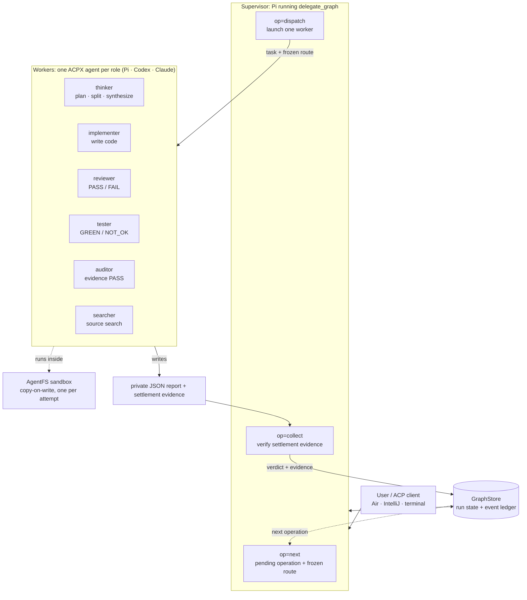
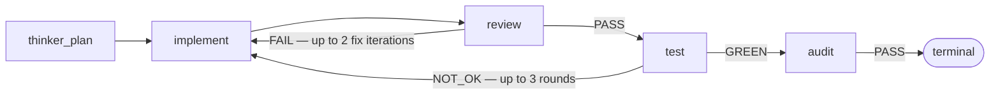

# pi-agent-wave

pi-agent-wave adds reliable multi-agent orchestration to Pi. JetBrains Air can launch Pi through ACP and control delegated work while pi-agent-wave runs Pi, Codex, and Claude workers through ACPX inside AgentFS sandboxes. Herdr is optional.

## Why use it?

- **Control Pi from Air.** Air owns the `pi-acp` session; pi-agent-wave returns structured progress, status, questions, cancellation, and results through Pi.
- **Keep complex work ordered.** A graph prevents review or testing from starting before its dependencies finish.
- **Isolate every attempt.** Each ACPX worker receives its own AgentFS copy-on-write sandbox and exports only audited owned paths.
- **Require proof.** Reports, process state, ACPX state, graph state, cleanup, and ledger evidence must agree before settlement.
- **Keep presentation optional.** Headless mode needs no Herdr process or workspace. Existing Herdr tabs and focus remain available when Herdr is active.

pi-agent-wave provides `/delegate`, `/graph`, the `delegate_graph` tool, ACP-safe structured questions, session metadata hooks, and model failover.

## How it works

A **supervisor** (Pi running the `delegate_graph` tool) coordinates a run. It does not do the work itself: it pulls the next pending operation from a shared **GraphStore**, dispatches one **worker** for it, and verifies the result before the graph advances. **Workers never talk to each other directly** — every hand-off flows through the supervisor and the GraphStore event ledger.

Each worker is one ACPX agent — Pi, Codex, or Claude — chosen by the run's frozen policy for that role, and it runs in its own AgentFS copy-on-write sandbox. The worker writes a private JSON report; the supervisor collects it and checks that report, process state, ACPX state, graph state, cleanup, and ledger evidence all agree before settling the operation.



In the **build** graph the supervisor walks the roles in order, with review and test able to loop back to implementation:



The **research** graph is `thinker_split → search (fan-out) → thinker_synthesize`, and the **operations** graph is `source_search (fan-out) → thinker_synthesize → audit`; each ends at a terminal node once its final audit passes.

## Requirements

- Pi `0.84.1` or `0.84.2`.
- ACPX `0.13.2`.
- Turso AgentFS `0.6.4`.
- For JetBrains Air: `pi-acp` `0.0.31` and an absolute Node/npx path.
- Optional: Herdr for visible worker tabs and focus.

ACPX, AgentFS, `pi-acp`, and Herdr are external runtimes and are not bundled.

## 1. Install ACPX and AgentFS

```bash
npm install -g acpx@0.13.2
acpx --version

agentfs --version
# expected: agentfs v0.6.4
```

AgentFS release downloads and checksums: https://github.com/tursodatabase/agentfs/releases/tag/v0.6.4

Claude execution requires a token created by `claude setup-token` and exposed only through a mode-600 file path in `PI_CLAUDE_OAUTH_TOKEN_FILE`. The doctor reports missing or insecure configuration without printing token values.

## 2. Install pi-agent-wave

The npm package has not been published yet. Install from a retained local source checkout:

```bash
pi install ./pi-agent-wave-new-design/extensions/pi-agent-wave
```

After npm publication, the install command will be:

```bash
pi install npm:@dpugliese/pi-agent-wave
```

Do not use the npm command before publication.

Preview and apply configuration from the source checkout:

```bash
node ./pi-agent-wave-new-design/extensions/pi-agent-wave/scripts/init.mjs
node ./pi-agent-wave-new-design/extensions/pi-agent-wave/scripts/init.mjs apply
node ./pi-agent-wave-new-design/extensions/pi-agent-wave/scripts/doctor.mjs
```

After npm publication, the package binaries will be `pi-agent-wave-init`, `pi-agent-wave-init apply`, and `pi-agent-wave-doctor`.

The default Pi home is `~/.pi/agent`. Set `PI_CODING_AGENT_DIR` or pass `--agent-dir` when another temporary Pi home is required.

## 3. Add Pi to JetBrains Air

In Air, open the agent selector and choose **Add ACP Agent**. Air opens its global `acp.json`. First obtain the absolute npx path:

```bash
command -v npx
```

Add Pi using that exact path:

```json
{
  "agent_servers": {
    "Pi": {
      "command": "/absolute/path/to/npx",
      "args": ["-y", "pi-acp@0.0.31"],
      "env": {
        "PI_CODING_AGENT_DIR": "/absolute/path/to/.pi/agent"
      }
    }
  }
}
```

Save `acp.json`, start a new Air task, and select **Pi**. Air launches and owns the Pi ACP process; pi-agent-wave does not claim that Air attaches to an externally owned ACPX worker session.

## 4. Run from Air

Ask Pi to use `delegate_graph`, for example:

```text
Use delegate_graph to implement tenant-scoped API keys. Keep me updated and ask before resolving blocked recovery choices.
```

Air receives structured tool progress and final results. Pi slash commands may not be exposed by every ACP client, so Air workflows use the equivalent `delegate_graph` operations for initialization, status, cancellation, recovery, and resume.

For structured source-command workflows, see [operational search delegation](extensions/pi-agent-wave/README.md#operational-search-delegation).

In a Pi terminal, the existing commands remain available:

```text
/delegate Implement tenant-scoped API keys
/graph status <runId>
/graph log <runId>
```

Headless workers cannot be focused. Use status and log inspection instead.

## Optional: Herdr presentation

Install Herdr only if visible worker tabs and focus are desired:

```bash
brew install herdr
cd /path/to/project
herdr
```

Start Pi inside the Herdr workspace. `auto` transport selects Herdr only when the executable and complete workspace/tab identity are present; otherwise it selects headless. Explicit `herdr` fails closed outside a valid workspace, while explicit `headless` never creates worker tabs.

## Worker execution and cleanup

pi-agent-wave uses **ACPX-only worker execution** through a shared transport-neutral lifecycle:

- `openai-codex/*` routes use ACPX Codex, `claude-code/*` routes use ACPX Claude, and other configured models use ACPX Pi.
- Every operation attempt gets a unique ACPX session and AgentFS overlay.
- Writable nodes export only audited graph-owned paths. Read-only nodes discard all overlay changes.
- Headless and Herdr adapters share planning, launch, report audit/repair, cancellation, export, settlement, and granular cleanup.
- Headless settlement records verified headless presentation identity and never invents Herdr visibility evidence.
- Pi execution-only supervisor reports are non-semantic. Provider credentials never enter package state or evidence.

For release verification, run `node --experimental-strip-types extensions/pi-agent-wave/scripts/production-audit.ts` outside AgentFS. Reviewers consume its source-current hash-indexed evidence through ACPX `--no-terminal` without rerunning nested package or AgentFS commands.

## Uninstall

```bash
pi remove ./pi-agent-wave-new-design/extensions/pi-agent-wave
```

After npm publication:

```bash
pi remove npm:@dpugliese/pi-agent-wave
```

Removing pi-agent-wave does not remove optional Herdr, routing configuration, migration backups, or stored Delegate Graph runs.

## Security

Pi extensions run with the user's system access. Review launch and configuration code before installation. pi-agent-wave packages no external runtimes, credentials, user settings, databases, or generated evidence.

## Compatibility

| Component | Tested version |
| --- | --- |
| Pi | `0.84.1`, `0.84.2` |
| ACPX | `0.13.2` |
| AgentFS | `0.6.4` |
| pi-acp | `0.0.31` |

JetBrains Air support requires the real installed-application rehearsal defined by `tasks/prd-air-controlled-editor-independent-orchestration.md`; no final compatibility claim is made until that proof passes.

## For contributors

Package source is under [`extensions/pi-agent-wave/`](extensions/pi-agent-wave/). Development rules are in [`AGENTS.md`](AGENTS.md). The active plan is [`tasks/prd-air-controlled-editor-independent-orchestration.md`](tasks/prd-air-controlled-editor-independent-orchestration.md).

pi-agent-wave is available under the [MIT License](extensions/pi-agent-wave/LICENSE).
