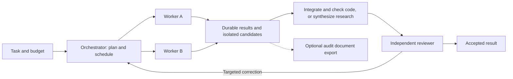

# Autonomous swarms with runtime-owned results

## Problem Statement

The user wants an orchestrator that organizes useful parallel work quickly. Today, work completion depends on agents producing bookkeeping artifacts correctly. A missing or malformed report can trigger another model turn even when useful work exists. The objective is to eliminate avoidable protocol failures and unnecessary serial work; provider outages, bugs and integration conflicts cannot be eliminated by design alone.

Observed in the current source:

- `scripts/report-prompt.ts` requires a nested claims/evidence JSON file, exact verdict vocabulary, multiple examples and a final `REPORT: <path>` response.
- `scripts/delegate_core.py::command_wait` validates that report and requests one repair turn before settlement. It exports owned files before writing and auditing the attempt ledger, so a later bookkeeping failure can follow a host mutation.
- `scripts/ledger.ts` revalidates reports, sequences files under a directory lock and audits the ledger directory. `lib/acpx-settlement.ts` treats ledger validity as a completion gate. `index.ts` revalidates reports and settlement evidence; operational searches also write operation-level ledger entries.
- `graph-core.ts` fixes ordinary builds to thinker → implementers → reviewer → tester → auditor. The last three stages are serial model roles even when deterministic checks and one integration decision would suffice.
- The current `headless_supervisor.py` owns a worker's process and output streams; it is not an autonomous run scheduler. Callers drive `next`, dispatch and collection through the extension.

These observations establish redundant responsibilities and failure surfaces, not a measured latency breakdown. Measure model, queue, startup, report repair, export, ledger, cleanup and integration time before claiming a speedup.

## Target User

A user asking Pi to complete coding or research tasks with several cooperating workers, without manually maintaining run identities, report files or ledgers. The user explicitly requires equal support for both from the first release. They share orchestration infrastructure and use task-appropriate outputs and acceptance criteria; research is not a later add-on.

## Success Signal

- Zero model calls whose sole purpose is formatting or writing a completion report.
- A worker with useful output does not lose its candidate because a derived audit document failed.
- Every attempt settles to a known process outcome; empty or interrupted attempts never become accepted work.
- Restart, duplicate collection and late events do not launch or integrate the same attempt twice.
- Independent ready work continues when another branch needs recovery, within concurrency and resource limits.
- Routine builds include one independent reviewer after implementation, integration and executable checks, without mandatory separate tester-model and auditor-model stages.
- Research runs include parallel investigation, source-supported synthesis and independent review. Successful research requires neither repository edits nor a passing test command.
- Each release slice is accepted only after coding and research paths both pass the relevant result, scheduling and recovery cases; latency and quality measurements report them separately.
- Measure time and spend per accepted task, false-completion rate, recovery success and manual interventions on matched tasks. A faster run that silently accepts broken work fails acceptance. Set numerical latency targets after a baseline exists.

## Candidate Directions

| Direction | Benefit | Limitation |
| --- | --- | --- |
| Simplify the current JSON schema | Small change; fewer formatting mistakes | File delivery and report repair remain failure points |
| Capture authored answers and generate records in the runtime | Removes report-writing work from agents | Requires adapter-specific result capture and acceptance rules |
| Replace fixed role chains with budgeted task dependencies | Less serial work; better parallel scheduling | Requires restart-safe scheduling and integration ownership |
| Keep present execution and make ledger exports optional | Removes a bookkeeping gate | Does not fix missing answers or mandatory model stages |
| Remove isolation and let workers edit one checkout freely | Simpler initial setup | Conflicting edits and unreliable rollback; not recommended |

## Recommended Direction

Combine runtime-owned records, direct answer capture and budgeted scheduling. Reuse ACPX, AgentFS, frozen model routing and the SQLite store. Remove paperwork from the normal path before attempting a new execution backend.

**Give each layer one responsibility.** The runtime owns process identity, timestamps, exit state, collected output and artifact references. Workers do the task and explain their result or blocker. The orchestrator decides whether the work satisfies the task. Audit documents are views over recorded facts, not another authority that can invalidate completed work.

**Capture the answer rather than request a file.** Adapters retain worker-authored public assistant output from ACP events, associated with the exact session, request and attempt. Do not treat thoughts, tool stdout, arbitrary transcript strings or `end_turn` as a final answer. Preserve the original answer and record its provenance. The worker may respond in ordinary prose; any optional structured envelope is parsed by the runtime and is not the sole success path. A dedicated completion tool is optional only where an adapter supports it; the design does not assume all agents expose custom tools.

**Separate execution, candidate and acceptance.** A clean exit means execution stopped. It may yield an answer, isolated file changes or both; it does not mean the task succeeded. The runtime always records termination independently of report quality. Keep useful changes as an unaccepted candidate. The orchestrator checks the task and artifacts and authors an explicit acceptance or correction decision. Tests are evidence for that decision, not proof of every requirement. Research needs actual retrieved material and an authored synthesis; it cannot be accepted from an exit code or empty answer. A silent turn still fails. A missing answer with useful artifacts becomes a candidate requiring inspection, not a fabricated worker verdict.

**Keep a small durable core; derive everything else.** Persist attempt identity, process outcome, candidate identity and acceptance atomically in the existing store where possible. Stream public output to bounded/chunked private storage instead of retaining the full stream in memory. Human-readable summaries and ledger exports are reconstructible and may fail independently. Failure to persist essential state must pause safely; moving audit documents off the critical path does not make all logging best-effort.

**Make one component own scheduling.** A single restartable scheduler holds a run lease and dispatches ready tasks based on persisted dependencies, path ownership and available slots. No worker creates untracked child swarms. Use stable attempt keys, lease fencing and conditional state transitions to reject duplicate launches, stale outputs and duplicate integration. Long-lived scheduling must survive the initiating chat turn. Resolve the exact hosting/lifecycle mechanism before implementation; the current per-worker supervisor should not silently become a second competing scheduler.

**Establish autonomy at session start and let the user change it.** This is a confirmed user requirement. Present the choice and budget limits visibly in chat at the beginning of a new session, before any swarm dispatch. Headless clients must provide an explicit setting or receive a structured configuration-required response; they cannot silently gain autonomous execution. Restoring the same session restores and displays its existing choice instead of asking again.

Proposed command contract (not yet implemented):

| Command | Effect |
| --- | --- |
| `/graph autonomy` | Show the effective session mode, budgets and affected active runs |
| `/graph autonomy auto` | Schedule ready work, bounded retries, review and corrections within the agreed scope and budget |
| `/graph autonomy confirm` | Request approval in visible chat before each new batch of worker launches, including retries, review and corrections |

Changing mode updates all attached new-contract runs in this session and future runs. Detached runs retain their recorded setting until explicitly reattached; show this boundary in status. Commit the setting change before acknowledging it, and have the scheduler check its version at each dispatch/integration boundary. Switching to `confirm` prevents new unapproved launches and not-yet-started workspace integration; already-running workers may finish and their output is collected safely. An integration already applying completes or rolls back to its defined checkpoint. Switching to `auto` releases only work waiting on orchestration approval: it does not reopen cancelled runs, extend budgets, change frozen models, or override tool permissions. Confirmation approves a named batch and its declared integration actions; it is not blanket authorization for later batches. Runtime collection and cleanup continue in both modes. Scope and budgets remain explicit, and the selected mode stays visible in session status.

This setting is separate from the existing model `--policy auto` option and the independent-review requirement. Compatibility handling for existing legacy runs must be explicit; do not silently reinterpret their recorded gates. Acceptance tests must cover startup without a choice, session restore, switching modes with live workers, a dispatch racing a mode change, stale approvals, exhausted budgets and preservation of model-policy locks.

**Coordinate artifacts centrally.** Workers retain isolated ownership. Capture audited candidate changes before teardown; integrate disjoint accepted candidates through one serialized integration owner against a recorded base revision. Detect changed bases and conflicts before applying anything. Preserve candidates across interrupted integration and reconcile its durable journal on restart. Do not replay arbitrary side-effecting commands solely because an acknowledgement was lost. Reuse the AgentFS transport; introducing worktrees or a different sandbox is not part of the first slice.

**Use a small workflow.** The orchestrator plans only as much as needed, reuses an existing plan, and dispatches independent tasks. Deterministic check commands run without a tester model merely narrating them. An independent reviewer then assesses the combined output against the task and returns approval or concrete findings, without a mandatory report file or ledger. The relevant implementer handles findings, affected checks rerun, and the reviewer checks the correction within a bounded loop. Additional specialist review is available for security-sensitive changes, unfamiliar architecture or an explicit user request. Check the final combined revision; passing isolated worker tests does not prove integration.

**Support coding and research equally from the first release.** Both use the same scheduler, session autonomy, budgets, adapter result capture, recovery and independent-review machinery. The deliverable determines how work is combined and judged:

| Task | Worker output | Combine and validate | Independent review |
| --- | --- | --- | --- |
| Coding | Isolated changes, explanation and relevant check output | Integrate against the recorded base and run applicable executable checks | Correctness, requirements, regressions and maintainability |
| Research | Findings, source references and limitations | Synthesize results, reconcile contradictions and remove duplicate findings | Source support, relevance, coverage, uncertainty and whether conclusions follow |

Research workers return ordinary answers with references to material they actually consulted; the runtime retains available source/tool provenance automatically. The synthesis preserves those references and distinguishes retrieved facts from inference. It must not invent citations or upgrade unsupported claims. Link availability alone is not proof that a source supports a claim. Missing access or inadequate coverage is a meaningful research limitation, not a report-format failure. Source references are part of a useful research deliverable, not a new mandatory nested bookkeeping schema.

Use the existing orchestrator to synthesize when sufficient; delegate a synthesis task when the volume or scope warrants it. The reviewer must be independent of the work being reviewed and must receive the relevant findings and accessible source material, rather than host-only file pointers. Research remains read-only with respect to the repository unless the task explicitly owns a deliverable path; retain answers in private runtime storage by default. Coding checks are selected for the code task, not imposed on research. Mixed tasks can use explicit dependencies such as investigation → implementation → review without a separate orchestration engine.

**Recover by cause.** Transient runtime failures use the existing bounded frozen-chain policy. Formatting differences need no repair model. Task defects lead to a targeted correction with the preserved candidate, not a full restart. A shared provider outage or global budget exhaustion can pause affected work; one branch-local failure should not park unrelated ready branches. Stop for genuine permission boundaries or unresolved requirements, not missing bookkeeping.

## Key Assumptions to Validate

- ACPX Pi, Codex and Claude adapters expose distinguishable, attributable public assistant output. Verify each with real adapters before enabling its new result contract; do not advertise generic capture based on one agent.
- Fewer mandatory model roles preserve sufficient task quality. Compare accepted results and defect detection, not just wall-clock time.
- Candidate retention and serialized integration work with the existing AgentFS ownership/export boundary and survive crashes without partial duplicate application.
- The store can be extended with a versioned contract, run lease and task dependencies without destabilizing current runs.
- Provider cost data may be unavailable. Enforce concurrency, wall time and attempt caps everywhere; use conservative reservations for cost limits and state clearly when precise spend is unknown.

## MVP Scope

Implement in independently reviewable slices, with the PRD and affected invariants updated before each behavioral change:

1. **Remove the report-file dependency for new-contract runs.** Capture authored answers; persist runtime outcomes and unaccepted candidates; separate acceptance from process settlement. Derive the optional legacy-style report/ledger export from actual recorded content. No positive verdict may be invented by a projection. Verify missing/malformed files, empty answers, cancellation, provider failure, duplicate collection, transcript truncation and essential-storage failure. Cover both code candidates and research answers/synthesis in this first slice; do not require a diff or test exit code for research acceptance. Initially retain existing scheduling and model policies so this change can be measured alone.
2. **Add autonomous scheduling.** Persist dependencies, concurrency limits, run budgets, session autonomy and one scheduler lease. Establish autonomy visibly at session start; expose the mode command and apply changes at scheduling boundaries. Dispatch/collect/recover according to that setting. Test restart after launch, late worker completion, duplicate scheduler attempts, branch-local failure and cancellation. Workers remain tracked children with declared access and owned paths where needed. Run the scheduling/recovery cases for both coding and research, including read-only research that has no exportable files.
3. **Add the simpler swarm workflow.** Use the orchestrator's plan, parallel workers and one independent reviewer for ordinary new runs. Coding integrates changes and runs relevant checks; research synthesizes findings and validates source support. Both workflows ship together. Keep the reviewer correction loop bounded and add further specialist review only when selected by the task's declared policy. Implement revision-bound candidate staging, conflict handling and restart-safe integration before allowing parallel write results to change the user workspace.

Keep `/delegate`, `/graph` and `delegate_graph` entry points. Introduce versioned run semantics behind an additive option whose exact schema belongs in implementation planning. Existing runs keep their recorded graph/report/evidence rules; never reinterpret historical failures, reopen cancelled runs or bypass old gates. Change defaults only after the replacement path passes acceptance. Document the transition in both user-facing READMEs and update `AGENTS.md` where its active invariants change.

## Not Doing

A full rewrite, another transport, unrestricted worker spawning, shared concurrent edits, invented semantic verdicts, automatic commits/pushes/publication, or a promise of zero provider/model errors. Preserve the current uncommitted Part C work and its verification limitations. Paid live benchmarks need separate authorization.

## Open Questions

Established in the discussion: keep an independent reviewer after implementation; choose orchestration autonomy at session start and allow changing it by command. Ask any further questions directly in visible chat, not through the invisible interactive control. Equal coding and research support from the first release is confirmed. Exact default budgets and additional specialist-review triggers remain open. The command spelling and boundary semantics above are concrete proposals; the session-level choice and ability to change it are confirmed requirements.

## Recommended Next nForma Step

Use task intake to turn slice 1 into an issue with a versioned result contract, ownership of each runtime decision, crash/replay acceptance cases for both coding and research, and a measurement plan that reports each separately. Implement that first; it directly addresses report errors and ledger overhead while keeping the later scheduler rewrite out of the same change.

Status: slice 1 task intake completed on 2026-09-11 in [the runtime-owned results issue](prd-runtime-owned-results.md) and [machine-readable intake](intake-runtime-owned-results.json), linked from the canonical package PRD. The guarded persistence/capture foundation is now implemented with focused verification; runtime-v1 remains publicly disabled. The issue brings the minimum safe coding integration checkpoint into slice 1 and requires independent research review before terminal acceptance while retaining current graph topology. Worker/lifecycle wiring, integration, semantic acceptance and all slice release criteria remain pending. No installed configuration or active run was changed during this work.
